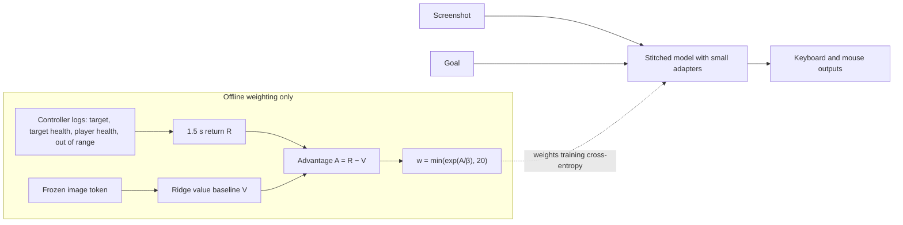

# Outcome-weighted imitation on weak Hordes labels

This experiment tests advantage-weighted regression
([AWR](https://arxiv.org/abs/1910.00177)) on the existing weak Hordes controller
labels. It asks whether weighting imitation by what the logged game state showed
afterwards makes the stitched Laya–Open-P2P model prefer attacks that land.
**It does not. No run is promoted, and there is no gameplay claim.**

The old controller's OCR state is used only offline, to weight training examples.
It is never a model input. At inference the model still receives only a
screenshot and a goal. No keyboard or mouse input was sent, and there were no
live trials.



## Method

### Reward

Each Hordes example is joined to its controller record via `provenance.log` and
`provenance.step`, and the recorded screenshot path must match. For the window
(t, t + 1.5 s] after that record:

- **Target damage D:** the selected target's OCR health fraction at t, minus the
  minimum later reading for a target with the **same name**. Drops of 0.02 or
  less count as zero.
- **Player health loss L:** the same calculation for the player's own health.
- **Return:** R = D − 0.5·L.
- **Out of range:** a flag set when any record in the window has `out_of_range`.
  It is not part of R.

When OCR is missing, the reward is zero and the case is counted.
`unidentified` means a target panel was visible without a trusted name or health.
`unobserved` means there were no later same-name readings. An incomplete window
means the log ended first. These attack counts reproduce the dataset's
`attack-outcomes.json` exactly.

| Split | Hordes frames | R > 0 | R < 0 | Mean R | Unidentified | Unobserved | Incomplete windows |
|---|---:|---:|---:|---:|---:|---:|---:|
| Train | 828 | 85 | 37 | 0.016 | 379 | 7 | 45 |
| Validation | 237 | 10 | 0 | 0.004 | 59 | 2 | 6 |
| Test | 178 | 58 | 1 | 0.047 | 1 | 0 | 6 |

| Split | Attack labels | Followed by damage | No damage, complete window | Unknown | Out of range after |
|---|---:|---:|---:|---:|---:|
| Train | 71 | 25 | 40 | 6 | 3 |
| Validation | 31 | 3 | 26 | 2 | 1 |
| Test | 29 | 15 | 13 | 1 | 3 |

Mean training return is 0.144 for attacks followed by damage and −0.001 for
attacks without damage. It is 0.024 for idle frames and 0.004 for other controls.
This is observation, not credit assignment. Windows after idle or movement
frames often contain damage from an earlier attack, for example in 49 of 335
training idle frames. Other players, same-named targets and OCR lag of about
0.2–0.6 s can also explain outcomes.

### Value baseline and weights

V(s) is a ridge regression on the standardized frozen 1024D image token, fitted
on training Hordes rows only. The goal text is the same for every Hordes row, so
it carries no state information. The penalty (α = 10,000) is chosen by
leave-one-recording-out cross-validation over the 15 training recordings.
Training advantages use leave-one-recording-out predictions, so no example's own
recording contributes to its baseline.

| Split | V R² | V damage AUC on attack frames | 95% frame bootstrap |
|---|---:|---:|---:|
| Train (out of recording) | 0.13 | 0.86 | 0.76–0.94 |
| Validation | −0.18 | 0.27 | 0.12–0.45 (three positives) |
| Test | 0.06 | 0.75 | 0.55–0.91 |

A = R − V is scaled to unit standard deviation. The weight is
w = min(exp(A/β), 20), and weights are rescaled to mean one over training Hordes
rows. This keeps the cross-entropy and KL terms balanced as in BC. Public replay
keeps weight one.

| Arm | Effective sample fraction | Clipped | Mean weight: attack + damage | Attack, no damage | Idle | Other | Weight share: attack + damage |
|---|---:|---:|---:|---:|---:|---:|---:|
| BC | 100% | — | 1.00 | 1.00 | 1.00 | 1.00 | 3.0% |
| AWR β = 0.5 | 16.7% | 7.5% | 7.53 | 0.24 | 1.27 | 0.48 | 22.7% |
| AWR β = 1 | 18.7% | 3.1% | 5.18 | 0.40 | 1.24 | 0.63 | 15.7% |
| AWR β = 2 | 33.4% | 0.0% | 2.69 | 0.66 | 1.16 | 0.81 | 8.1% |

Idle frames retain roughly half the total weight because many follow successful attacks.

### Training and selection

Every arm uses the visual-adapter recipe with balanced idle sampling and shortcut
gates. It trains 252,033 parameters: rank-4 decoder LoRA, the appended Tab
embedding/output and a 64-unit visual residual. Settings: AdamW at 1e-4, batch
eight, 600 updates, and half public human replay with KL preservation weight one.

BC and AWR differ only in per-example cross-entropy weights. Seeds, sampler draws
and updates are identical. With seed 20260923, the BC arm reproduces
`laya-p2p-visual-adapter-003` exactly. Losses, validation and shuffle metrics
match at all 13 checkpoints, as do its frozen hash and test metrics. Two seeds ×
four arms make 4,800 updates.

Validation alone selects checkpoints, using the existing rule. The score averages
Hordes button F1, supported-button macro F1 and public F1. A checkpoint is
rejected if public F1 falls by more than five points, idle false positives rise
by more than ten points, or Hordes F1 is not two points above a within-game image
shuffle. Test never selects weights.

Validation kept update 0 in **all eight runs**, so every selected model equals the
untrained adapters. The results below therefore also report the fixed final
update, 600. That checkpoint is a predeclared endpoint, not a selected one.
Frozen parents are unchanged, and fresh-image inference matches the
cached-feature path.

### Outcome-aware metrics

- **P(attack):** the model's probability of key "1" under the canonical ascending
  key order, P(k0 = "1") + P(k0 = space)·P(k1 = "1" | k0 = space).
- **Damage AUC:** among recorded attack frames with a known outcome, the AUC of
  P(attack) for damage-followed frames versus the rest. Chance is 0.5.
- **Attack-vs-idle AUC:** separation of attack-labelled frames from idle frames.
  Mean P(attack) on idle frames is reported too.
- **Controls:** one fixed within-game image permutation per split, shared by all
  arms and seeds.
- **Intervals:** class-stratified frame bootstrap. It ignores correlation within
  a recording, so intervals are optimistic.

## Results

Final update 600, mean of two seeds. Test contains 15 damage-followed attack
frames versus 13 without damage.

| Test | Hordes button F1 | Idle false positives | Public F1 | Damage AUC | Shuffled | Attack vs idle AUC | Shuffled | Mean P(attack), idle |
|---|---:|---:|---:|---:|---:|---:|---:|---:|
| Untrained adapters | 8.5% | 5.8% | 83.9% | 0.35 | 0.54 | 0.65 | 0.52 | 0.0003 |
| BC | 2.6% | 0.5% | 81.4% | 0.41 | 0.62 | 0.60 | 0.48 | 0.10 |
| AWR β = 0.5 | 5.1% | 0.0% | 81.7% | 0.50 | 0.38 | 0.58 | 0.39 | 0.09 |
| AWR β = 1 | 3.9% | 0.0% | 81.7% | 0.47 | 0.45 | 0.58 | 0.40 | 0.09 |
| AWR β = 2 | 1.3% | 0.0% | 81.0% | 0.42 | 0.51 | 0.57 | 0.46 | 0.09 |

| Test damage AUC (95% frame bootstrap) | Seed 20260923 | Seed 20260924 |
|---|---:|---:|
| Untrained adapters | 0.35 (0.16–0.57) | same |
| BC | 0.47 (0.23–0.67) | 0.35 (0.16–0.57) |
| AWR β = 0.5 | 0.44 (0.23–0.66) | 0.56 (0.34–0.79) |
| AWR β = 1 | 0.45 (0.24–0.67) | 0.49 (0.28–0.70) |
| AWR β = 2 | 0.39 (0.19–0.61) | 0.44 (0.23–0.67) |

The validation split has only three damage-followed attacks, against 26 without
damage. It cannot support an outcome comparison:

| Validation | Hordes button F1 | Idle false positives | Public F1 | Damage AUC | Shuffled | Attack vs idle AUC |
|---|---:|---:|---:|---:|---:|---:|
| Untrained adapters | 8.6% | 12.1% | 84.3% | 0.28 | 0.40 | 0.55 |
| BC | 2.0% | 2.8% | 82.2% | 0.23 | 0.35 | 0.56 |
| AWR β = 0.5 | 0.0% | 0.0% | 81.2% | 0.41 | 0.21 | 0.50 |
| AWR β = 1 | 2.2% | 0.9% | 80.5% | 0.38 | 0.26 | 0.51 |
| AWR β = 2 | 0.7% | 0.5% | 81.5% | 0.33 | 0.26 | 0.50 |

What the runs establish:

- **No preference for attacks that land.** AWR's test damage AUC is
  indistinguishable from BC, from chance and from its own shuffled-image control.
  Every run's interval includes 0.5. Shuffled controls also range from 0.31 to
  0.69.
- **Attack probability rises indiscriminately.** Training raises P("1") from
  about 0.0003 to 0.06–0.18 on attack and idle frames alike. Attack-vs-idle AUC
  does not exceed the untrained model's 0.65.
- **Greedy decoding becomes more idle.** Almost no attacks are predicted:
  attack-key F1 is 0–6.7%, idle false positives fall to about zero, and Hordes
  F1 falls below the untrained model's 8.5%.
- **The value baseline shows limited signal the adapters do not use.** On test,
  the image-only baseline ranks attack outcomes at 0.75 (0.55–0.91), so the frozen
  image token may carry outcome information for that recording pair. Validation
  does not confirm it: 0.27 with three positives. With 25 positive training
  attacks, the adapters do not learn to use that information.

## Limitations

- Validation and test are two recordings each, reused across project
  experiments. They are development holdouts, not a fresh final test. Only two
  seeds were run.
- Returns are short-horizon and undiscounted observations of a weak controller.
  The value baseline removes only part of the credit leaking into idle and
  movement frames. Out-of-range feedback is flagged but not penalized; only three
  training attacks carry the flag.
- This is one offline AWR iteration on fixed data. AWR normally improves by
  collecting data with the improved policy, which would require live trials.
- The model is single-frame, without action history. The same recipe already
  failed for BC, and public replay games may overlap parent pretraining.
- Untested variants: attack-only reweighting, decoder-only adapters
  (`--bottleneck 0`), longer horizons and bootstrapped returns.

Reweighting cannot create the missing supervision. Testing outcome-aware learning
properly needs synchronized demonstrations with many visible successful and
failed attacks, recorded in fresh whole sessions.

`artifacts/hordes-awr-001` ran the same trainings and produced identical losses
and unshuffled metrics. It failed its own identical-baseline check because it
seeded shuffle controls per training seed, so it is superseded by
`artifacts/hordes-awr-002`. Numbers are retained in
[hordes-awr-results.json](hordes-awr-results.json).

## Reproduce

```sh
.venv/bin/python -m pytest -q tests/test_hordes_awr.py
.venv/bin/ruff check scripts/train_hordes_awr.py tests/test_hordes_awr.py
PYTHONPATH=. .venv/bin/python scripts/train_hordes_awr.py \
  --bundle artifacts/laya-p2p-bridge-001/bundle \
  --data artifacts/hordes-radio-data-001 \
  --cache artifacts/p2p-visual-features-001 \
  --output artifacts/hordes-awr-new \
  --steps 600 --betas 0.5 1 2 --seeds 20260923 20260924
```

The run needs the controller logs at their recorded provenance paths, under
`../jev_wow_control/runs/*/events.jsonl`. It takes about ten minutes on the
M3 Max. Outputs are `rewards.jsonl` (per-example return, outcome flags, V and
weights), per-arm/seed `progress.json` and `report.json`, selected and final
adapter weights, and `summary.json`. Output directories must be new. No bundle
is exported, and nothing sends game input.
