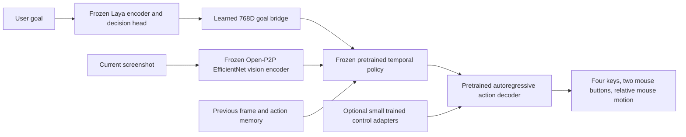

# Laya with a pretrained visual control model

This experiment preserves a pretrained game-action policy instead of learning a
new action decoder from a few short clips. It runs as one local MLX model and one
exported checkpoint. **It is not a reliable Hordes player.**

## Architecture



Laya supplies goal features in this architecture; the pretrained Open-P2P
transformer combines them with vision and action history. Laya does not itself
receive the screenshot. This does not inherit Qwen's full reasoning or establish
that arbitrary English instructions are followed correctly.

There is no runtime OCR state, combat state machine, caption generator, retrieval
bank, controller teacher, target-selection rule or external planner. Screenshot
resizing and physical token decoding are transport, not a gameplay policy.

The release uses a 192×192 full-frame RGB image, a 1024D image token, ten policy
transformer layers, up to 200 frames of memory, and three action-decoder layers.
The original action vocabulary has no Tab. The optional adaptation appends a
learned Tab embedding/output; it does not remap another key or inject Tab events.

## Evidence on this M3 Max

Measurements below use distinct recorded Hordes screenshots. Full-cache numbers
cover 40 frames after the 200-frame memory fills. Each stitched prediction runs
fresh image preprocessing, vision, Laya goal encoding, policy and action decoding.
They exclude capture, event posting and game contention.

| Candidate | Median | p95 | Result |
|---|---:|---:|---|
| Pretrained Open-P2P, no Laya, greedy | 28.01 ms | 28.53 ms | Idle on all 240 frames |
| Stitched Laya–P2P, greedy attack goal | 31.34 ms | 39.29 ms | Idle on all 240 frames |
| Stitched Laya–P2P, sampling temperature 1 | 31.69 ms | 32.70 ms | 195 active steps; no attack-key predictions |

The sampling run predicted movement, jump, mouse motion and seven left-button
presses. These are offline predictions, not evidence of combat or correct clicks.
Temperature 1 is the published Open-P2P default. Greedy decoding's idle collapse
is not fixed by substituting the original released goal embedding.

### Live trials on 2026-09-23

| Configuration | Duration | Inference p50 / p95 | Screenshot-to-first-event p50 / p95 | Gameplay |
|---|---:|---:|---:|---|
| FP32 policy, 30 FPS capture | 53.2 s, stopped on focus loss | 33.5 / 63.4 ms | 81.3 / 108.0 ms | Four ability-1 presses; visible “Out of range”; no verified damage |
| BF16 policy, FP32 vision, 60 FPS capture | Full 60 s | 34.3 / 36.9 ms | 60.7 / 73.8 ms | Movement and camera controls; no ability presses or XP gain |

The second trial recorded 905 decisions, 294 steps with input events, and two
temporal-memory resets. The selected Young Grub had 50/50 health at both endpoints;
player health stayed 244/244 and XP stayed 466/1600 in the reviewed captures.
There were no verified kills. Its endpoint was closer to the target, but that is
not evidence of deliberate approach or successful combat.

Median timing components were 9.4 ms for frame age before inference, 0.4 ms for
the subsequent HUD check, 3.8 ms waiting for the previous input pulse, and 11.6 ms
for native focus/layout guards. Component medians need not sum to total latency.
The first-event metric excludes idle steps and ends at event posting, not game
acknowledgement. Both capture rate and precision changed between runs, so this
comparison cannot attribute improvement to either change alone.

The precision audit retained all 512 highest-probability actions across 64
recorded frames; mean distribution KL was 0.0000104. This checks numerical
compatibility, not sampled-action identity or gameplay correctness. Vision stays
FP32. A BF16-to-NumPy warmup error stopped an intermediate attempt before inputs;
the runtime now casts logits to FP32 for finite checks, with regression coverage.

**Neither reliable combat nor sub-60 ms median live reaction has been established.**
The next learning experiment needs synchronized successful approach-and-attack
demonstrations, with whole-session holdouts. Reusing these failed rollouts as
positive demonstrations would reinforce the failure. A faster encoder alone
does not teach the missing range and attack behavior.

Local evidence is under `artifacts/hordes-p2p-live-001` and
`artifacts/hordes-p2p-live-003`; each contains timestamped proposals, screenshots,
a reconstructed video and a review page. Numeric summaries are retained in
`docs/laya-p2p-results.json`.

## Conversion checks

- Full FP32 transformer/decoder conversion compared against the original upstream
  Torch modules across three consecutive frames, including forced nonempty action
  history: maximum context error 0.000092, cache error 0.000021, no argmax
  disagreements across 24 decoder positions.
- NumPy preprocessing matches `fast_image_resize==5.1.4` Hamming interpolation
  byte for byte on seven downsampling, upsampling and boundary cases. Unlike
  Pillow's Hamming downsampling, this interpolation does not widen its kernel.
- Tests cover temporal masking, target-action leakage, full-cache rollover,
  parallel versus autoregressive decoder logits, LoRA freezing and preservation
  of original action outputs when adding Tab.
- FP16 vision conversion remains rejected because it produces nonfinite values.

The model and data source pins and license notices are in
`third_party/Open-P2P.NOTICE`. Rust is only an optional offline resize reference;
the runtime does not spawn Rust or Torch processes.

## Goal bridge

Only a regularized linear goal bridge was fitted. Its supervision is the public
dataset's precomputed 768D Gemma text features, not a running Gemma model.
The paired corpus contains 1,294 unique instructions from 212 recordings after
removing two conflicting targets. There are 899 training, 217 validation and
178 test instructions. Three games are withheld from bridge fitting.

| Split | R² versus training-mean embedding | Centered cosine | Paired retrieval top-1 |
|---|---:|---:|---:|
| Training | 0.298 | 0.583 | 53.2% |
| Validation | 0.179 | 0.431 | 29.5% |
| Withheld games | 0.035 | 0.209 | 8.4% |

Retrieval is an evaluation statistic only; there is no retrieval during inference.
Frozen parent hashes and export/reload checks pass. The bridge has weak transfer
to new games. Raw embedding cosine alone would conceal that weakness.

## Image and goal interventions

On single-frame public-game samples, shuffling images increases the negative
log-likelihood of recorded active buttons (lower is better):

| Game | Examples | Correct image | Shuffled image | Blank image |
|---|---:|---:|---:|---:|
| Hordes.io | 40 | 5.72 | 5.95 | 6.96 |
| A Dusty Trip | 24 | 0.78 | 2.53 | 2.90 |
| Be a Snake | 24 | 0.47 | 1.15 | 2.25 |
| Evade | 24 | 0.95 | 1.10 | 2.36 |

This supports visual dependence, particularly on the public games. It does not
prove generalization beyond parent pretraining: those games may occur in the
released model's training data. Hordes targets are weak controller labels, not
human demonstrations. Changing the goal to “Stand still and do nothing” changes
button probabilities only slightly and does not establish instruction following.

## Small control adaptation

The experimental control adapter trains 120,897 parameters: rank-four LoRA in
the three decoder layers and the appended Tab embedding/output. Vision, Laya,
goal bridge, temporal policy and original decoder weights remain frozen.

Training uses single-frame frozen policy contexts with eight causally shifted
action targets. Cached features are a training optimization; the exported model
still runs fresh vision. The first 600-step experiment sampled equally across
game/activity groups. Validation rejected every trained checkpoint and retained
step zero. Its Hordes test button F1 was only 8.5%.

Increasing Hordes sampling to 50% and training for 1,500 steps also failed:
validation again retained step zero. The final trained step had Hordes validation
button F1 of 0%, despite a low sampled training loss. Neither adapter experiment
was promoted. These results do not justify more repetitions on the same weak
labels. Clean synchronized Hordes demonstrations and training through the visual
connector are the remaining experiments; neither has established success yet.

## Reproduce

From the repository root, with the pinned checkpoint and dataset already downloaded:

```sh
uv sync --extra stitch --extra data --extra reference
PYTHONPATH=. .venv/bin/python scripts/train_laya_p2p_bridge.py \
  --policy artifacts/p2p-pretrained-policy-002 --output artifacts/bridge-new
PYTHONPATH=. .venv/bin/python scripts/profile_laya_p2p.py \
  --bundle artifacts/laya-p2p-bridge-001/bundle \
  --frames artifacts/hordes-temporal-live-002/frames \
  --alignment artifacts/laya-p2p-bridge-001 --output artifacts/profile-new
PYTHONPATH=. .venv/bin/python scripts/audit_laya_p2p.py \
  --bundle artifacts/laya-p2p-bridge-001/bundle \
  --manifest artifacts/hordes-radio-data-001/test.jsonl --output artifacts/audit-new
PYTHONPATH=. .venv/bin/python scripts/train_p2p_control_adapter.py \
  --bundle artifacts/laya-p2p-bridge-001/bundle \
  --data artifacts/hordes-radio-data-001 --output artifacts/control-new \
  --steps 1500 --hordes-fraction 0.5
```

Reports and checkpoints stay under ignored `artifacts/`. None of these commands
sends keyboard or mouse input. The bounded experimental live runner accepts this
checkpoint format when explicitly selected with `--bundle`; existing defaults
have not changed. Its streaming memory commits the action reported as actually
dispatched, not an unexecuted proposal. Missing action feedback, a new goal/session
or a gap above 100 ms resets memory. A three-frame offline streaming smoke check
passes. Live tests require an unlocked, visible game and valid calibration.
The runner accepts `--capture-fps 30|60|120` and `--crop X Y 1280 720` to match the
reviewed viewport, including Chrome toolbars. Focus, layout and HUD checks remain
active; calibration must be refreshed when the window layout changes.
