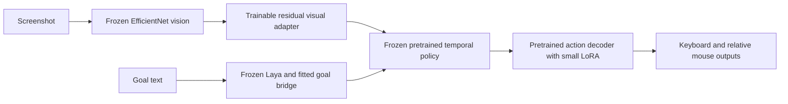

# Training the visual connection to the pretrained action policy

This continuation adds a trainable visual residual to the stitched Laya–Open-P2P
model. It does not add a gameplay state machine, online teacher or planner. The
pretrained Laya, vision, temporal-policy and original decoder weights remain
frozen. Fresh inference still runs one neural model from screenshots and a goal.



The visual adapter is `x + up(silu(down(layer_norm(x))))`, with a 64-unit
bottleneck and zero-initialized output. Initial predictions therefore retain the
original visual features exactly. Gradients pass through the frozen temporal
policy into this adapter. Depending on decoder LoRA rank, the experiment trains
252,033 or 608,577 parameters, including the appended Tab embedding/output.
The matched decoder-only control trains 120,897 parameters.

## Supervision and experiment design

Training uses 1,401 examples after rejecting three unsupported-control labels:
828 weak Hordes controller examples and 573 public human-control examples.
Validation has 285 examples and the test split has 250. Hordes recordings stay
in whole-session splits. Source-weight hashes, dataset-manifest hashes, image
hashes and cross-split episode/image checks protect the feature cache.

Only frozen vision and Laya features are cached for training. The temporal-policy
context is recomputed with gradients, unlike the previous decoder-only trainer.
An exported checkpoint is checked against fresh screenshot preprocessing,
vision and Laya inference after reload. This is single-frame adaptation; it does
not train the pretrained temporal memory on dense Hordes trajectories.

The objective combines weighted action-token cross-entropy with KL preservation
of the original policy's distributions on public replay. There is no teacher at
inference. Public validation performance must remain within five percentage
points of the original mean button F1.

The first runs exposed a sampling problem: balancing every Hordes button set
made idle only one of eight groups, although idle accounts for 335/828 training
examples. A later sampler draws idle/active Hordes examples with equal probability,
then balances button sets within the active group. Half of training draws are
public replay. This changes supervision, not runtime behavior.

Subsequent checkpoint selection also requires:

- Validation idle false-positive rate no more than ten percentage points above baseline.
- Validation Hordes button F1 at least two percentage points above a fixed within-game image shuffle.
- Improved combined Hordes micro/macro and public-game F1 relative to the initial model.

These are development checks, not proof of causality or gameplay skill. There
are only two Hordes validation recordings and two test recordings. Repeated use
makes them development holdouts; a final claim needs fresh sessions. Public games
may also overlap the pretrained parent's original training data.

## What the experiments established

Five full-data runs completed 4,400 optimizer updates, followed by the separate
200-update capacity result below. No new model was promoted.

| Experiment | Updates | Selected update | Outcome |
|---|---:|---:|---|
| Visual adapter + rank-16 decoder, initial preservation | 600 | 0 | Public replay regressed; original weights retained |
| Visual adapter + rank-4 decoder, stronger preservation | 600 | 200 | Apparent F1 gain rejected after idle/shuffle review |
| Visual adapter + rank-4 decoder, balanced idle and shortcut checks | 600 | 0 | No qualifying improvement |
| Matched decoder-only control | 600 | 0 | No qualifying improvement |
| Visual adapter + rank-16 decoder, higher learning rate | 2,000 | 0 | Longer training still failed the checks |

Update zero means the exported bundle contains the initial pretrained behavior
plus identity/zero-initialized adapters, not a successfully trained replacement.

An early checkpoint raised Hordes test button F1 from 8.5% to 18.2%, but predicted
controls on **95/104 idle examples**. Shuffling images raised its F1 to 22.5%.
That apparent gain is rejected. It is not a better Hordes player.

A separate capacity diagnostic fits four examples from each of eight Hordes
button sets, using training rows only. After 200 updates it reached **96.6%
button F1 and 93.8% exact button-set accuracy** on those 32 images. Shuffling the
images reduced F1 to **13.8%**. Frozen parent hashes were unchanged.

This establishes that the adapter and gradient path can learn image-specific
controls on a small set. It does not establish correct attack timing, camera
motion, new-scene transfer, goal following or live gameplay. The diagnostic
weights are labelled ineligible for deployment.

The result is a working visual-learning path, but **no improved live agent**.
These experiments do not prove that data quality is the only bottleneck:
resolution, missing action history in training and domain transfer may matter.
They do show that more updates on this particular weak-label recipe are not
enough. The next useful dataset should contain synchronized successful
approach/attack sequences, unsuccessful attempts with visible outcomes, and
fresh whole-session holdouts. No new live latency or gameplay claim is made.

Numeric experiment results are retained in `p2p-visual-adapter-results.json`.
Large checkpoints and raw reports remain under ignored `artifacts/`.

## Reproduce

```sh
PYTHONPATH=. .venv/bin/python scripts/train_p2p_visual_adapter.py \
  --bundle artifacts/laya-p2p-bridge-001/bundle \
  --data artifacts/hordes-radio-data-001 \
  --cache artifacts/p2p-visual-features-001 \
  --output artifacts/visual-adapter-new \
  --steps 600 --rank 4 --learning-rate 0.0001 --replay-kl 1 \
  --balanced-idle --shortcut-gates
```

Use `--bottleneck 0` for the matched decoder-only control. The longer experiment
uses `--steps 2000 --rank 16 --learning-rate 0.001` with the same replay and
selection settings. Output directories must be new; reports are never overwritten.

```sh
PYTHONPATH=. .venv/bin/python scripts/diagnose_p2p_adapter_fit.py \
  --bundle artifacts/laya-p2p-bridge-001/bundle \
  --cache artifacts/p2p-visual-features-001 \
  --output artifacts/adapter-capacity-new --steps 800
```

The capacity diagnostic stops when its training-set fitting threshold is met.
Neither script sends game inputs or changes the live controller's checkpoint.
