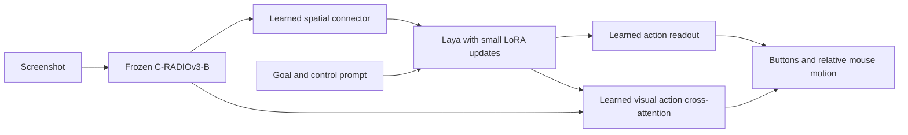

# Faster pretrained vision for the stitched model

The experimental model can now use the frozen **C-RADIOv3-B** visual backbone
instead of Qwen's vision tower. It remains one neural inference graph: screenshots
and an ordinary goal/control prompt enter the model; physical button and mouse
outputs leave it. No OCR state, generated captions, nearest-image bank, teacher
controller, target-selection rule or combat policy supplies runtime actions.

**This is not a reliable Hordes player.** Speed and fitting a small set of images
are separate from learning useful closed-loop behavior.

## Architecture



The direct action branch preserves a path from dense visual features to controls,
conditioned on Laya's contextual token features. It is trained, not a hand-written
gameplay policy. This recipe updates 5,014,954 of 524,569,791 parameters (0.956%):
connector, action outputs, visual action branch and rank-8 LoRA in two Laya layers.
Original vision and Laya backbone weights remain frozen; export/reload checks
verify the same first action.

We also tested gated visual cross-attention inserted before Laya's last three
layers, inspired by [Flamingo](https://arxiv.org/abs/2204.14198). That experiment
did not solve Hordes action learning and is not the selected architectural path.
Neither method transfers a complete Qwen language reasoner into Laya.

## Encoder verification and speed

Source: [NVIDIA C-RADIOv3-B](https://huggingface.co/nvidia/C-RADIOv3-B), pinned at
`44653a0482cf460bb4f12595fc3cc3dfecc403d1`. Its reference reports a 90M-parameter
visual feature extractor. Model weights retain the NVIDIA Open Model License;
see [notice](../third_party/C-RADIO.NOTICE).

The native MLX port was checked against the pinned official PyTorch reference on
two real Hordes screenshots, in FP32 and FP16, at widths 224, 320, 384 and 448.
FP32 minimum patch cosine similarity was at least 0.99999982. At width 384,
FP16 minimum patch cosine exceeded 0.99993. These are numerical conversion checks,
not evidence of gameplay understanding.

Measured on this Apple M3 Max, with fresh image preprocessing/encoding each time:

| Operation | Median | p95 |
|---|---:|---:|
| RADIO FP16, width 224, visual features only | 9.73 ms | 10.65 ms |
| RADIO FP16, width 320, visual features only | 12.02 ms | 12.49 ms |
| RADIO FP16, width 384, visual features only | 14.85 ms | 15.63 ms |
| RADIO FP16, width 448, visual features only | 17.87 ms | 18.56 ms |
| Full RADIO + Laya + direct action adapter, width 384 | **30.97 ms** | **46.83 ms** |

The full prediction measurement uses 80 distinct sampled screenshots after five
warmups and includes preprocessing, fresh vision, prompt tokenization, Laya,
action heads and Python action decoding. It excludes disk loading, desktop
capture, event posting and active-game contention. **It does not establish a
sub-60 ms screenshot-to-keypress response.** The last actual live temporal trial
had a 75.71 ms median even before its first input event was posted.

The live runner now records dispatch-start and first-posted-event timestamps
separately. Idle predictions have no event latency and cannot artificially lower
that measurement. No new model was deployed during these offline experiments.

## What the training tests establish

The import contains 828 weak Hordes training frames from 15 complete runs, 237
validation frames from two later runs, and 178 test frames from two other runs.
Mixed-game replay adds 576 training frames from nine games. Splits are checked for
episode and exact-image leakage. The old controller's state fields are not model
inputs; labels are its recorded controls, not verified optimal actions.

Replacing the encoder alone produced zero Hordes button F1. Positive class
weighting produced an attack prediction on every held-out Hordes frame; shuffled
images barely changed performance. Adding three layers of gated visual fusion
also failed: validation button F1 was 0.0937, with attack predicted on every frame.

The direct visual action branch passed a **32-image fitting diagnostic**: all 32
training button sets correct, versus zero when screenshots were permuted across
those examples. Mouse error was 0.19 px per axis. This proves it can learn
image-dependent controls on that set. It does not prove transfer to another run.

Scaling the same architecture to the full mixed dataset for 3,000 updates did
**not** pass: the checkpoint selected by validation macro F1 (step 250) proposed
no buttons on all 237 held-out Hordes validation frames and all 178 test frames.
Hordes button F1 was zero in both splits. It is rejected for deployment. Merely
running more updates on these labels is not a demonstrated solution.
[Machine-readable results](radio-stitch-results.json).

The weak demonstrations are an additional bottleneck. Only 25 of 71 training
attack presses were followed within 1.5 seconds by a decrease in a same-named
target's recorded health; validation had 3 of 31 and test 15 of 29. These counts
are observational, may miss delayed results, and may include damage from other
players or another target with the same name. They are not verified successful
attacks. Some inspected attack-labelled screenshots show a distant selected enemy.

A passive [human-demonstration recorder](HUMAN_DEMONSTRATIONS.md) now preserves
screenshots, key holds, press/release edges and camera/click controls at their
actual timestamps. Several independent successful sessions and instructed goals
are needed to test learning rather than memorizing an old controller's mistakes.

## Reproduction

```bash
uv sync --extra models --extra stitch --extra data --extra reference --group dev
.venv/bin/hf download nvidia/C-RADIOv3-B \
  --revision 44653a0482cf460bb4f12595fc3cc3dfecc403d1 \
  --local-dir artifacts/radio-source
PYTHONPATH=. .venv/bin/python scripts/profile_radio.py \
  --source artifacts/radio-source --images /path/to/frame1.png /path/to/frame2.png \
  --output artifacts/new-radio-parity
.venv/bin/python -m laya_vision_stitch.hordes_demonstrations \
  --runs ../jev_wow_control/runs --p2p artifacts/temporal-expanded-data-001 \
  --output artifacts/new-hordes-radio-data
.venv/bin/python -m laya_vision_stitch.radio_training \
  --source artifacts/radio-source --data artifacts/new-hordes-radio-data \
  --output artifacts/new-radio-direct --steps 3000 --batch-size 4 --visual-action-adapter
PYTHONPATH=. .venv/bin/python scripts/profile_fresh_policy.py \
  --bundle artifacts/new-radio-direct/bundle \
  --manifest artifacts/new-hordes-radio-data/validation.jsonl \
  --output artifacts/new-radio-latency
```

Recorded game data is local and not committed. Supply manifests from the documented
P2P temporal import and local ScreenQuest recordings; do not substitute random
frames across splits. For the small fitting diagnostic use `--small-fit-per-action 4
--steps 1000 --batch-size 8`. Selection uses validation macro game button F1;
test examples do not choose a checkpoint. Frozen visual features are cached only
during training, never for fresh-image inference timings.

Local artifacts: `radio-parity-001`, `hordes-radio-data-001`, `hordes-radio-001`,
`hordes-radio-balanced-001`, `hordes-radio-fusion-001`, `hordes-radio-smallfit-001`,
`hordes-radio-latency-001`, and `hordes-radio-direct-001` beneath `artifacts/`.

## Pretrained gameplay policy investigation

The [Open-P2P release](https://github.com/elefant-ai/open-p2p) supplies pretrained
visual control policies, not just demonstration data. The 150M-labelled checkpoint
was downloaded from its official script's source, `guaguaa/open-p2p`, revision
`de18b62bc8f9722bda64497600c38c8f7634d86b`, and inspected using PyTorch's restricted
`weights_only=True` loader. It includes an EfficientNet image front end, a causal
policy transformer, and an autoregressive keyboard/mouse decoder.

Its **image tokenizer only** has now been ported to MLX. FP32 matches torchvision
loaded with the gameplay weights (maximum token error 0.0000063) and takes
**5.15 ms median / 5.40 ms p95** for fresh-image preprocessing and encoding.
BF16 takes 4.88 / 5.01 ms but has larger numerical error (minimum token cosine
0.99917, maximum absolute token error 0.187). FP32 remains the conservative
candidate. FP16 produced nonfinite values and is explicitly rejected by the loader.

These measurements use 80 encodes of two real Hordes images after five warmups.
They do not include the policy or Laya, and do not measure gameplay quality.
Model parity uses identical input tensors: Pillow's Hamming resize is not yet
verified against upstream Rust interpolation. The policy transformer, action
decoder and Laya connection remain unported/unvalidated. Local reference checks:
`artifacts/p2p-pretrained-vision-003/report.json`; [license notice](../third_party/Open-P2P.NOTICE).

The important test is whether pretrained gameplay weights transfer better than
the new action heads above. A Laya connection must be trained and shown to carry
the goal; matching embedding dimensions alone does not make the representations
compatible. The release's keyboard vocabulary excludes Tab, so target selection
cannot be assumed to work unchanged. This is a candidate for a further experiment,
not a claimed working replacement.
