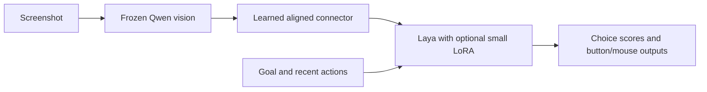

# Scaling the learned stitch

This experiment moves beyond the original chance-level pilot. It remains a
controlled synthetic study, not a WoW/Hordes policy or a general game model.
See [results and limitations](SCALING_RESULTS.md).

## What changed

The initial query connector did not discover a useful visual-to-language
interface from action loss alone. Increasing its training to 2,000 steps and
preserving spatial tokens did not solve that. Adding description supervision
helped, but initialization still mattered.

The active `aligned` connector pools Qwen's pretrained patch features onto a
generic 4×4 spatial grid, projects them through a small MLP, and predicts a
residual around 16 trainable input vectors. Those vectors start at the mean of
**training descriptions' Laya embeddings**. They subsequently learn through
gradient descent. No validation descriptions enter initialization.

During training, the model receives an auxiliary loss toward each image's
description embeddings, in addition to question/action losses. At inference it
receives only images and ordinary goal/control/history text. Descriptions,
answers, simulator coordinates, reference images and object labels are absent.
No language decoder produces captions. The aligned connector encodes the scene;
goal conditioning happens inside Laya, which reads that state alongside the goal.



The larger connector and action heads contain 5,956,112 trainable parameters,
about 0.783% of the composite model. Adding rank-8 LoRA to QKV/output projections
in the final two Laya layers adds 98,304 parameters. Original Qwen and Laya
weights remain frozen and are hashed before/after every run. The complete model
exports to one safetensors file plus tokenizer/config/image processor files.

## Three training stages

1. **Grounding:** 256 training scenes, two opposing goals per image. Four colors,
   three shapes, varied location/size/resolution and three backgrounds. Two
   color/shape combinations and a fourth visual style are excluded from training.
2. **Movement views:** mix the original examples with 256 additional scenes
   containing panned views, targets near the center, a player marker and previous
   actions. These address failures observed in an initial closed-loop sandbox.
3. **Multiple objectives:** expand the same training images into move-toward,
   move-away, left-color and left-shape questions. Direction tasks include button
   labels; factual questions do not. Changed goals discard old teacher targets.
   Small LoRA adapters let Laya adapt to the broader instruction set without
   updating its original parameters.

Descriptions/action labels in these experiments come from the procedural
environment. They are not Qwen-generated labels or human demonstrations. Qwen's
pretrained vision is reused; full-Qwen offline teacher commands remain available
for other datasets. This experiment does not establish transfer of all Qwen's
reasoning knowledge.

## Reproduce

Use the setup and pinned model downloads in [the training guide](TRAINABLE_STITCH.md).
The commands below use fresh output directories. They run locally on Apple
Silicon, with no OS keyboard/mouse events.

The final recipe uses consistent left-to-right description targets, explicit
leftmost questions, varied wording and shuffled answer choices. This is training
supervision/augmentation, not a detector or rule in the deployed policy. These
steps start from the frozen pretrained backbones; earlier experimental runs are
not required:

```bash
uv run --no-sync python -m laya_vision_stitch.scaling_data --output artifacts/data-a
uv run --no-sync python -m laya_vision_stitch.scaling_data \
  --output artifacts/data-b --recovery --seed 2041 --mix-with artifacts/data-a/train.jsonl
uv run --no-sync python -m laya_vision_stitch.multitask_data \
  --manifest artifacts/data-b/mixed-train.jsonl --output artifacts/data-b/canonical-train.jsonl \
  --canonical-descriptions
uv run --no-sync python -m laya_vision_stitch.multitask_data \
  --manifest artifacts/data-a/validation.jsonl --output artifacts/data-a/canonical-validation.jsonl \
  --canonical-descriptions
uv run --no-sync python -m laya_vision_stitch.policy train \
  --config configs/scaled.json --train artifacts/data-b/canonical-train.jsonl \
  --validation artifacts/data-a/canonical-validation.jsonl --feature-cache artifacts/features \
  --steps 8000 --learning-rate 0.0001 --train-eval-limit 192 --output artifacts/model-canonical
uv run --no-sync python -m laya_vision_stitch.multitask_data \
  --manifest artifacts/data-b/mixed-train.jsonl --output artifacts/data-b/robust-train.jsonl \
  --canonical-descriptions --paraphrases
uv run --no-sync python -m laya_vision_stitch.policy train \
  --bundle artifacts/model-canonical/bundle --train artifacts/data-b/robust-train.jsonl \
  --validation artifacts/data-a/canonical-validation.jsonl --feature-cache artifacts/features \
  --steps 4000 --learning-rate 0.00003 --train-eval-limit 192 --shuffle-options \
  --output artifacts/model-final
```

The measured final local checkpoint is
`artifacts/scaled-robust-001/bundle`; `./scripts/start-model.command` loads it.

### Historical curriculum runs

These earlier runs established the failure modes and are retained for comparison:

```bash
uv run --no-sync python -m laya_vision_stitch.scaling_data --output artifacts/data-a
uv run --no-sync python -m laya_vision_stitch.policy train \
  --config artifacts/data-a/config.json \
  --train artifacts/data-a/train.jsonl --validation artifacts/data-a/validation.jsonl \
  --feature-cache artifacts/features --steps 4000 --learning-rate 0.0001 \
  --output artifacts/model-a

uv run --no-sync python -m laya_vision_stitch.scaling_data \
  --output artifacts/data-b --recovery --seed 2041 --mix-with artifacts/data-a/train.jsonl
uv run --no-sync python -m laya_vision_stitch.policy train \
  --bundle artifacts/model-a/bundle \
  --train artifacts/data-b/mixed-train.jsonl --validation artifacts/data-b/validation.jsonl \
  --feature-cache artifacts/features --steps 3000 --learning-rate 0.00005 \
  --output artifacts/model-b

uv run --no-sync python -m laya_vision_stitch.multitask_data \
  --manifest artifacts/data-b/mixed-train.jsonl --output artifacts/data-b/multitask-train.jsonl
uv run --no-sync python -m laya_vision_stitch.multitask_data \
  --manifest artifacts/data-a/validation.jsonl --output artifacts/data-a/multitask-validation.jsonl
uv run --no-sync python -m laya_vision_stitch.policy train \
  --bundle artifacts/model-b/bundle --add-lora-rank 8 --add-lora-layers 2 \
  --train artifacts/data-b/multitask-train.jsonl \
  --validation artifacts/data-a/multitask-validation.jsonl \
  --feature-cache artifacts/features --steps 4000 --learning-rate 0.00005 \
  --train-eval-limit 192 --output artifacts/model-c

# Longer mixed-objective refinement at a lower learning rate:
uv run --no-sync python -m laya_vision_stitch.policy train \
  --bundle artifacts/model-c/bundle \
  --train artifacts/data-b/multitask-train.jsonl \
  --validation artifacts/data-a/multitask-validation.jsonl \
  --feature-cache artifacts/features --steps 8000 --learning-rate 0.00002 \
  --train-eval-limit 192 --output artifacts/model-d
```

`--feature-cache` stores frozen vision features by image content, actual vision
weight hash, processor configuration, resolution and frame ages. Only eight
histories remain resident in the feature cache. Goal-specific text inputs stay
separate; different goals reuse vision computation without reusing labels.
`--train-eval-limit` bounds training-set evaluation using a fixed random subset;
validation remains complete. Training is still batch-size-one MLX, not a
distributed trainer. Continuing a bundle restarts optimizer state.

## Evaluation and sandbox

Generate fresh test scenes and evaluate against the complete training manifest:

```bash
uv run --no-sync python -m laya_vision_stitch.scaling_data \
  --output artifacts/fresh-test --seed 2083
uv run --no-sync python -m laya_vision_stitch.scaling_eval \
  --bundle artifacts/model-final/bundle --data artifacts/fresh-test \
  --training-manifest artifacts/data-b/robust-train.jsonl \
  --feature-cache artifacts/features --output artifacts/model-final/holdouts.json
uv run --no-sync python -m laya_vision_stitch.goal_transfer \
  --bundle artifacts/model-final/bundle --manifest artifacts/fresh-test/validation.jsonl \
  --feature-cache artifacts/features --output artifacts/model-final/questions.json
uv run --no-sync python -m laya_vision_stitch.goal_transfer \
  --bundle artifacts/model-final/bundle --manifest artifacts/fresh-test/validation.jsonl \
  --paraphrase --feature-cache artifacts/features --output artifacts/model-final/paraphrases.json
uv run --no-sync python -m laya_vision_stitch.policy_sandbox \
  --bundle artifacts/model-final/bundle --output artifacts/model-final/sandbox \
  --episodes 40 --seed 9406
```

The sandbox is one-dimensional target approach. A centered player moves through
a scrolling view containing two objects. The goal names one object. A/D outputs
from the model determine movement; there is no fallback controller or detector.
The environment alone knows coordinates for rendering, physics and scoring.
An episode succeeds when the player reaches the target within ten steps.
PNG traces, a GIF preview and a JSON report preserve every decision.

Use a **new seed** for further development after examining these results.
The final checkpoint used fresh test-scene seed 2083 and sandbox seed 9406.
The 9401 sandbox was a development diagnostic; 9402 was the paired comparison
after adding movement-view training. More iterations on either make them
development sets, not fresh final tests.

Held-out evaluation measures scene-level opposite-goal correctness, option-order
changes, zeroed features and shuffled images. Bootstrap intervals sample whole
scenes, keeping correlated questions together. Composition results separately
report questions whose target itself has a withheld color/shape combination.
`goal_transfer` compares the student with Laya receiving the exact description.
After stage three, those question families are trained tasks on unseen images;
they must not be reported as zero-shot instruction transfer.

## Persistent local API

Keep a single model loaded instead of starting a Python process for every frame:

```bash
uv run --no-sync python -m laya_vision_stitch.serve \
  --bundle artifacts/model-final/bundle --port 8767
```

`GET http://127.0.0.1:8767/health` reports readiness. `POST /predict` accepts JSON
with a goal, optional controls/previous actions/choices, and oldest-first frames
containing `image_base64` and `age_seconds` (latest is zero). Images are decoded
in memory. No arbitrary server-side file paths or supervision fields are inputs.
The single inference worker returns the same probabilities, button proposals,
mouse/pointer predictions and duration as the offline CLI. No OS events are sent.
Stop the server with Ctrl-C in the terminal where it was started.

```python
import base64, json, urllib.request
from pathlib import Path

payload = {
    "goal": "Move toward the red circle. Which direction should you move?",
    "controls": "A moves left. D moves right.",
    "choices": {"left": "Move left.", "right": "Move right."},
    "frames": [{
        "image_base64": base64.b64encode(Path("screenshot.png").read_bytes()).decode(),
        "age_seconds": 0,
    }],
}
request = urllib.request.Request(
    "http://127.0.0.1:8767/predict", data=json.dumps(payload).encode(),
    headers={"Content-Type": "application/json"},
)
with urllib.request.urlopen(request) as response:
    print(json.load(response))
```

This is an integration interface, not an automatic game controller. A caller
must implement its own screenshot capture and map predicted controls to the
game's input API. Predicted controls outside the demonstrated curriculum remain
unvalidated, even though the interface accepts arbitrary images and goals.

## Limits before real games

These are basic spatial/factual/action primitives. They do not establish combat,
camera control, reading arbitrary UI text, loot collection, unseen-game transfer,
or robust long-horizon behavior. Mouse/pointer heads exist, but this study's
closed-loop test uses A/D only. It does not validate mouse clicking or camera
movement. Frame histories are supported in the architecture; the measured
training curriculum uses single frames with optional previous-action text.

The next substantive dataset must contain varied real screenshots, goals,
reliable visual grounding labels and synchronized expert actions. Entire games
must be held out. More repetitions of this synthetic curriculum cannot substitute
for those data. No external compute was purchased and no real game was operated.
