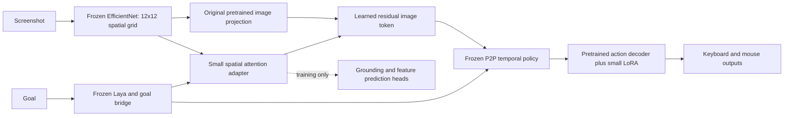

# Four improvements tested without gameplay sequences

Five 800-update runs tested spatial attention, reviewed screenshot grounding,
offline feature distillation, paired goal supervision, and all additions together.
Every example supplies exactly one current image. No action history, sequence,
caption, annotation or teacher output enters the deployed model as an input.

The results show useful visual learning, but **no qualified Hordes player**.
Grounding is the strongest component result. Goal-conditioned controls still
fail to transfer to new games and wording. None replaces the live checkpoint.

## The stitched architecture



The goal produces four 64D queries over 144 spatial locations. Learned patch
positions, keys and values retain location information before the original
16,128-to-1,024 projection. A zero-initialized output projects the attention
result back to a 1,024D residual, preserving pretrained behavior at initialization.
The architecture is a learned neural connection, with no target-selection rules,
HUD parser, retrieval policy or online teacher.

All pretrained Laya, vision, temporal-policy and original decoder parameters stay
frozen. The runs train 604,801–655,235 parameters. Auxiliary heads are saved for
research reproducibility but are skipped in the live forward pass. Strict export
and fresh-image reload checks pass with unchanged frozen-parent hashes.

## Data and teachers

Gameplay supervision is unchanged: 1,401 training examples, including 828 weak
Hordes controller labels and 573 public human-control examples. Validation/test
contain 285/250 examples. These are not verified successful Hordes demonstrations.

Static grounding uses 64 training images from Grounded, Minecraft and Raft,
64 images from different recordings for validation, and 64 images from Monster
Hunter Wilds and Core Keeper for testing. The reviewed fact is whether a large
menu, inventory or map overlay is visible. It does **not** supervise monster
locations, attack range, health values or combat outcomes.

The training/validation sets mostly show closed menus, while the test set mostly
shows open menus. Grounding batches are balanced by visible state, and balanced
accuracy averages the two state recalls. This prevents an all-open prediction
from being reported as strong visual recognition.

Qwen3.5-4B-4bit proposes labels offline, using one image and both answer orders:

- Direct next-token letter scoring qualified only 4/64 training labels.
- Generated evidence qualified 32/64; many other answers were truncated before
  the final letter. They were not accepted by reading the prose heuristically.
- A final-answer-first retry on rejected cases qualified 63/64. Every accepted
  label agrees with the prior, hash-verified visual review in both answer orders.

This is reviewed teacher-assisted annotation, not independent teacher accuracy:
known training labels filter the proposals. No teacher-generated intent or action
label is treated as expert gameplay.

The feature teacher is Google's [SigLIP 2 base patch16 224](https://huggingface.co/google/siglip2-base-patch16-224),
revision `75de2d55ec2d0b4efc50b3e9ad70dba96a7b2fa2`. Its frozen 14x14 patch grid is
bilinearly aligned to the student's 12x12 grid. Targets subtract a per-position
mean computed from unique **training** images, preventing a global mean feature
from dominating the similarity score. SigLIP and Qwen are absent at inference.
See `third_party/SigLIP2.NOTICE` and the existing dataset notices.

Paired goal examples ask for W held when the menu is open versus when it is
closed. These are explicitly synthetic conditional-control probes from real
screenshots, not recorded player intentions. Both goals for a given image must
be correct to count a pair as successful. Training balances menu state and
requested action. Validation and test use different instruction wording.

## Results

The table reports the validation-selected checkpoint in each run. Each mode has
its own auxiliary objective; selection is not directly comparable across modes.
All modes also limit regression on the small public-game validation sample.

| Training addition | Selected update | Hordes test button F1 | Grounding balanced accuracy | Both opposing goals correct |
|---|---:|---:|---:|---:|
| Spatial attention only | 700 | 7.2% | — | 0.0% |
| Reviewed screenshot grounding | 700 | 11.3% | 81.3% | 0.0% |
| SigLIP feature distillation | 700 | 2.2% | — | 0.0% |
| Paired goal supervision | 700 | 5.5% | — | 1.6% |
| All additions | 200 | 0.0% | 78.1% | 4.7% |

The original model's Hordes test button F1 is 8.5%. The grounding candidate's
small increase to 11.3% comes from movement/camera labels; it predicts no attack
keys on the 29 attack-labelled test examples. It has 18 false-positive active
steps among 104 idle-labelled examples, versus six for the original model.
It is not a demonstrated gameplay improvement.

The grounded head's 81.3% balanced accuracy drops to 51.7% with within-game image
shuffling. Its raw accuracy is 89.1% on 64 test screenshots. This supports
image-dependent menu recognition across the tested games, not combat skill.

The distilled adapter reaches 0.278 centered teacher-feature cosine on test
images, versus 0.189 with shuffled images. Distillation transfers some visual
information but regresses Hordes action F1. Its untrained grounding head is not
reported as a qualified classifier.

Both goal-trained variants fit all training goal pairs at the final update,
but their selected checkpoints fail the new-game/new-wording test. Combining
the losses does not solve this failure. Raw pair accuracy remains affected by
menu-state prevalence; the very low transfer scores establish no useful goal
following, regardless of that imbalance.

These splits have been used in earlier project experiments. They are development
holdouts, not a fresh independent final evaluation. Their small size, weak
Hordes labels and possible overlap with parent pretraining limit the conclusions.
Fresh gameplay success and screenshot-to-input latency remain unestablished.

## Fresh-image inference cost

All training and teacher jobs finished before this benchmark. Each model processed
240 different recorded Hordes screenshots, with fresh preprocessing and fresh
Laya goal encoding. The reported 40 samples come after the 200-frame memory fills.
The policy and vision use FP32. No auxiliary head or offline teacher is evaluated.

| Model | Median | p95 |
|---|---:|---:|
| Original stitched model, same benchmark | 38.1 ms | 39.3 ms |
| Spatial attention | 41.2 ms | 42.0 ms |
| Grounded | 41.0 ms | 119.4 ms |
| Distilled | 45.0 ms | 50.8 ms |
| Goal-trained | 42.1 ms | 46.8 ms |
| Combined | 42.4 ms | 48.2 ms |

These are offline model timings, excluding screenshot acquisition, input posting
and game acknowledgement. Forty steady-state samples are insufficient for a
robust tail-latency characterization; the grounded model's observed tail spike
is retained rather than hidden. No sub-60 ms end-to-end reaction claim follows.

## Reproduction and evidence

The current cache is `artifacts/spatial-data-003`. Earlier incomplete cache
attempts are retained as local failure evidence. Cache generation validates
image hashes and split image/episode separation. Only newest frames are retained
from source manifests.

```sh
PYTHONPATH=. .venv/bin/python scripts/prepare_spatial_experiments.py \
  --bundle artifacts/laya-p2p-bridge-001/bundle \
  --data artifacts/hordes-radio-data-001 --output artifacts/spatial-data-new

PYTHONPATH=. .venv/bin/python scripts/cache_spatial_teachers.py features \
  --data artifacts/spatial-data-new
PYTHONPATH=. .venv/bin/python scripts/cache_spatial_teachers.py labels-generated \
  --data artifacts/spatial-data-new
PYTHONPATH=. .venv/bin/python scripts/cache_spatial_teachers.py labels-reviewed \
  --data artifacts/spatial-data-new

PYTHONPATH=. .venv/bin/python scripts/train_spatial_experiments.py \
  --bundle artifacts/laya-p2p-bridge-001/bundle \
  --data artifacts/spatial-data-new --output artifacts/spatial-run-new \
  --mode combined --steps 800
```

Mode is one of `spatial`, `grounded`, `distilled`, `goals`, or `combined`.
Pinned teacher weights must already be downloaded; feature extraction uses only
the vision tower. The `labels` mode reproduces the rejected next-token audit.
The teacher scripts require the project's existing Torch/Transformers and
MLX-VLM dependencies. No script sends game inputs.

Checkpoints and raw reports are under `artifacts/spatial-experiment-001` through
`005`. Both last-update adapters and the validation-selected full model are
saved. Compact results, teacher audits and latency measurements are retained in
`docs/spatial-experiment-results.json`.
