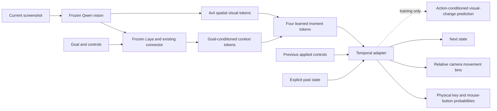

# Temporal action adapters

For the subsequent data expansion, regularization and new-game comparison, see
[Broader temporal training and goal coverage](TEMPORAL_EXPANSION.md).

This experiment adds learned memory to the single-checkpoint Qwen-vision/Laya
policy. It compares a **Mamba-3 SISO block plus local attention** against **two
causal attention blocks**, using the same demonstration windows, action-head
architecture, optimizer, seed and loss. Neither variant changes the frozen parent.
This is an offline imitation experiment, not demonstrated Hordes gameplay.

## Measured results

All six runs failed the qualification gate. One seed was used; this is a small
exploratory comparison, not an architecture leaderboard. The 6,000-update runs
were added because the 1,500-update models underfit the training clips.

| Adapter | Updates | Auxiliary weight | Train F1 | Validation F1 | Withheld-experience F1 |
|---|---:|---:|---:|---:|---:|
| Mamba-3 + attention | 1,500 | 0.1 | 51.3% | 77.0% | 75.6% |
| Causal attention | 1,500 | 0.1 | 58.5% | 71.1% | 66.8% |
| Mamba-3 + attention | 1,500 | 0 | 56.2% | 65.2% | 53.6% |
| Causal attention | 1,500 | 0 | 64.0% | 75.3% | 59.7% |
| Mamba-3 + attention | 6,000 | 0.1 | **92.7%** | 56.8% | 58.0% |
| Causal attention | 6,000 | 0.1 | **98.5%** | 64.7% | 57.8% |
| Repeat previous human action | — | — | 89.9% | **97.1%** | **92.7%** |

The longer runs demonstrate that the adapters can fit these sequences, while
transfer gets worse. On the 6,000-update checkpoints, both models correctly
predict only **2 of 30 validation button transitions**. Validation camera MAE
on moving examples is **53.16 px/axis** for Mamba and **50.06** for attention,
versus **49.58** for always predicting zero movement. On withheld experiences,
shuffling observations produces button F1 of **61.4% / 58.8%**, versus actual
**58.0% / 57.8%**. Neither result demonstrates useful visual control.

Memory does help fit the training clips: resetting at every frame drops the
6,000-update transformer from 98.5% to 79.7% training F1. This reset ablation
changes the input distribution; by itself it does not prove motion understanding.
The auxiliary task has mixed effects at equal training budget. At 6,000 updates,
Mamba's future-feature MSE improves over a zero-change baseline on training
(0.689 vs 1.000), but worsens on validation (1.806 vs 0.884). It also overfits.

| Dedicated warm profile on M3 Max | Full-path median | Full-path p95 | Memory-module median |
|---|---:|---:|---:|
| Mamba-3 + local attention | **44.46 ms** | 45.48 ms | 0.76 ms |
| Causal attention | **45.62 ms** | 46.35 ms | 0.65 ms |

These profiles process **128 freshly encoded frames in four consecutive clips**
from Left 4 Dead 2 and Be a Tornado. Timings include disk image loading,
preprocessing, prompt preparation, Qwen, Laya, the temporal adapter and decoding.
They exclude screenshot capture, input posting and competition with a running
game. Earlier timings during the initial experiment reached 74–82 ms median;
the separate warm profile is not a guarantee under load. This is not a Hordes
latency or gameplay measurement. Qwen vision accounts for roughly 29–30 ms and
Laya/connector for 13 ms; memory is not the latency bottleneck.

Mamba trains **1,034,501 / 764,746,601 parameters (0.135%)**. Attention trains
**989,493 / 764,701,593 (0.129%)**. All six runs verify identical parent weight
fingerprints, matching actions after checkpoint reload, and fresh-image streaming
agreement with the cached training graph. The unit suite contains **107 passing
tests**, including independent recurrence equations, causal masking, streaming
state, future-target isolation, split leakage and alignment checks.

[Machine-readable results, controls, provenance and latency](temporal-memory-results.json)
· [Sequence selection audit](temporal-data-001.json).

The evidence points to **generalization and supervision**, not a missing recurrent
cell. The next useful scale-up needs substantially more independent episodes and
varied instructed goals, followed by fresh game/session evaluation. This pilot's
training set is only 64 seconds of selected clips and all its goals are generic.
Increasing memory complexity again is not justified by these results. A pretrained
gameplay policy is a useful separate baseline before spending on a much larger
adapter training run. No Hordes control test or default-model replacement ran.

## Model



The memory operates **after** frozen Laya, using its goal-conditioned features
and a direct spatial vision path. It does not insert changing memory tokens into
Laya's input. This lets training reuse the exact frozen computations while
training the new moment pooling, memory, action heads and auxiliary predictor.
There is one neural pipeline and one weights file; no generated captions,
external planner, hand-coded game state, retrieval bank or game-specific rules
select actions. Qwen's language/reasoning layers are not included.

Both adapters have width 128. Four learned queries read 16 spatial visual tokens
and two Laya summaries (CLS and mean visual-slot context). The moment tokens are
combined into one timestep representation. The previous applied controls have
explicit availability flags and a learned numeric embedding; they are omitted
from Laya's text prompt. Training drops this numeric history for 50% of sequences.

- **Mamba-3:** one SISO block, expanded width 256, eight heads, state width 32,
  followed by causal attention over eight timesteps. The recurrent state is not
  truncated at the attention window.
- **Attention comparison:** causal attention over 32 timesteps followed by
  attention over eight timesteps, with learned relative-position biases and
  bounded KV caches. The two-layer receptive field can exceed 32 frames.

The architectures have different parameter counts; this is not a precisely
parameter-matched architecture ranking. New action heads predict only one
50 ms step. Pointer positions, loot clicks at coordinates and future action
chunks are not supervised by this experiment.

## Mamba implementation audit

The MLX implementation follows the official Mamba-3 SISO equations, pinned to
`state-spaces/mamba` commit `e9594ce1c732d97440f0332fdc43170a2294dbfa`.
It includes input-dependent heavy-tail decay, the learned trapezoidal update,
rotary complex-state phases and SiLU output gating. It uses a differentiable
parallel affine scan for sequence training and the same equations with explicit
state for streaming. No Mamba pretrained weights are involved.

The community `Jada42/mlx-mamba3` port was inspected at
`c4e50f5d5f04630fe474c24db28b5387e9424557`; its decay, angle and trapezoidal update
differ from the official code, so it was not used. Tests compare our MLX sequence
calculation with independently written serial NumPy equations, streamed steps,
chunked execution and future-frame perturbations. **CUDA-kernel parity has not
been tested on this Mac.** Upstream attribution and Apache-2.0 terms are in
[the notice](../third_party/mamba3.NOTICE).

## Data and training protocol

The importer reuses the ten complete, hash-verified P2P recordings and recording
splits in `configs/p2p-stream-pilot.json`, pinned to dataset revision
`1553d6b8190d270dcd256528ffa2066098225dba`. It selects eight nonoverlapping,
constant-goal windows of 32 consecutive 20 FPS frames per recording:

| Split | Windows | Action-labelled frames | Games/experiences |
|---|---:|---:|---|
| Train | 40 | 1,280 | Doom, Left 4 Dead 2, Be a Tornado, Blade Ball, Hypershot |
| Validation | 16 | 512 | Separate Left 4 Dead 2 and Be a Tornado recordings |
| Test | 24 | 768 | Evade, Be a Snake, A Dusty Trip |

Each current image at index `t` supervises the upstream-defined action annotation
at `t+1`; the previous applied action is annotation `t`. The extra image at `t+1`
is **only an auxiliary target**. Invalid actions, gaps, irregular video intervals
and ambiguous/changing instruction windows are excluded. Current and future
image hashes are checked across splits. Memory resets at each window.

**All 40 selected training windows have the generic continuation goal.** Validation
and test each include four distinct goals, but these results cannot establish
learning of varied instructions. P2P's specific instruction annotations are
retrospective weak labels, not ground-truth player intent. The splits also are
not player-independent, some development experiences were used in prior work,
and the nearby Left 4 Dead 2 recordings may share an underlying co-op session.

The initial comparison uses 1,500 AdamW updates, two sequences per batch, learning rate 0.0003,
global gradient clipping at 1.0 and weight decay 0.01. All frames contribute to
loss. Button transitions receive 3x weight. Camera supervision combines weighted
categorical cross-entropy with expected absolute motion error. Statistics and
loss weights come only from training data.

The auxiliary task predicts the **change in 64 fixed spatial/channel-group
summaries of frozen vision features** between `t` and `t+1`, conditioned on the
hidden state and demonstrated action. Per-channel training RMS scales normalize
the loss; its weight is 0.1. The target encoder cannot collapse with the adapter,
and target images never enter the action forward pass. This is a coarse latent
prediction task inspired by action/world modelling, not video generation,
causal intervention evidence or a reproduction of GameWAM.

## Evaluation

Reports include button F1, exact action-transition agreement, moving-camera MAE,
per-game results, future-feature error versus predicting no change, and:

- **No previous actions:** remove the numeric control input.
- **Reset each frame:** remove both recurrent state and attention history.
- **Shuffled observations:** exchange vision and Laya observation embeddings
  within the same game and exact goal; preserve previous controls and labels.
- **Shuffled history:** reorder only the strictly earlier prefix, retaining the
  current frame at the end.
- **Self-fed controls:** feed the model's prior proposed controls instead of the
  recorded human controls after the first frame. Screenshots still come from
  recordings, so this is not closed-loop gameplay.
- **Persistence/idle baselines:** repeat the recorded prior action, or issue no
  controls.

The qualification gate, fixed in code before the run, requires validation F1 to
beat persistence, at least a 0.05 F1 advantage over shuffled observations,
transition exact agreement above 0.25, and moving-camera error below both
persistence and zero-motion baselines. Even passing would not by itself establish
live gameplay or instruction following. No experimental model is auto-deployed.

## Reproduce

Use the existing environment with `stitch`, `models`, `data` and development
dependencies installed. The following expects the previously imported local P2P
source and parent checkpoint; neither large artifact is included in Git.

```bash
.venv/bin/python -m laya_vision_stitch.sequence_data \
  --source artifacts/p2p-stream-combined \
  --plan configs/p2p-stream-pilot.json \
  --output artifacts/temporal-data-001 --count 8 --length 32

.venv/bin/python -m laya_vision_stitch.temporal_training \
  --bundle artifacts/p2p-pilot-004/bundle \
  --data artifacts/temporal-data-001 \
  --output artifacts/temporal-memory-001 --steps 1500
```

Use `--auxiliary-weight 0` with a fresh output directory for the matched
no-auxiliary comparison. Use `--steps 6000` with a fresh output directory to
reproduce the longer training runs, such as `artifacts/temporal-memory-002`.
All reported runs start from the same parent rather than resuming a selected model.

```bash
PYTHONPATH=. .venv/bin/python scripts/profile_temporal.py \
  --bundle artifacts/temporal-memory-002/mamba3/bundle \
  --manifest artifacts/temporal-data-001/validation.jsonl \
  --output artifacts/my-temporal-profile --clips 4
```

The feature cache includes parent fingerprints, configuration, current image
hashes, the last future image hash and the complete manifest digest. It stores
only frozen computations. Every checkpoint contains the frozen parent and new
adapter in `model.safetensors`, plus local tokenizer/processor and configuration.
Reloaded outputs and fresh-image streaming outputs must match the cached graph.
The old stateless API deliberately rejects temporal checkpoints instead of
silently omitting memory.

## Streaming without desktop inputs

```python
from laya_vision_stitch.temporal_runtime import TemporalRuntime

model = TemporalRuntime.load("artifacts/temporal-memory-001/mamba3/bundle")
proposal = model.predict(
    {
        "goal": "Continue the current activity.",
        "controls": "Physical keys and mouse buttons; mouse_delta is raw motion / 512. Act for 50 ms.",
        "frames": [{"image": "/absolute/path/current.png", "age_seconds": 0}],
        "previous_actions": [{"buttons": ["w"], "mouse_delta": [0, 0]}],
    },
    session_id="episode-1",
    timestamp_seconds=0.0,
)
print(proposal)
```

A runtime owns one session. Supply monotonically increasing screenshot timestamps;
reset on a new episode. Goal/control-prompt/session changes or a gap greater than 100 ms reset
memory automatically. Pass actual applied controls, not actions that were merely
proposed. Call `model.reset()` explicitly after interruption. Runtime state is
detached between steps and is not saved into model weights. The included JSONL
CLI runs the same interface and sends no keyboard/mouse events:

```bash
.venv/bin/python -m laya_vision_stitch.temporal_runtime \
  --bundle artifacts/temporal-memory-001/mamba3/bundle \
  --requests /absolute/path/requests.jsonl
```

Model latency measures fresh image loading/preprocessing, current Qwen vision,
prompt preparation, Laya, temporal state update and decoding. It excludes screen
capture, event posting, game response and competition with a running game.

## Research sources

- [Mamba-3 paper](https://arxiv.org/abs/2603.15569) and
  [official implementation](https://github.com/state-spaces/mamba).
- [HAMLET](https://arxiv.org/abs/2510.00695): inspiration for moment tokens and
  temporal action memory; this implementation is not a HAMLET reproduction.
- [GameWAM](https://arxiv.org/abs/2608.26200): inspiration for auxiliary future
  visual prediction; this adapter is not its model or training recipe.
- [Open P2P](https://huggingface.co/elefantai/open-p2p): a separately pretrained
  gameplay baseline, not incorporated or benchmarked by this adapter experiment.
