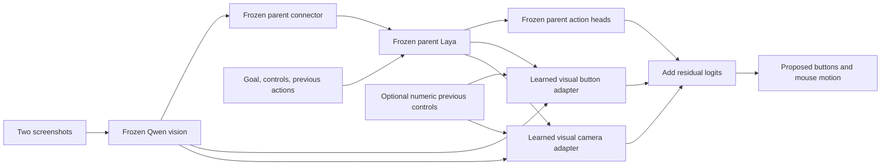

# Visual action adapter and expanded human recordings

This continuation changes the learned model, not a game-specific action rule.
It adds two small, independent action branches that attend directly to frozen
Qwen visual patches and to Laya's encoded goal/control context. This gives the
action outputs a path around the connector's 16-token visual bottleneck.



This remains one neural inference graph and one exported checkpoint. There is
no caption generator, nearest-neighbor action lookup, game-specific detector or
handwritten action selection. Laya still processes ordinary text goals. Qwen's
language decoder and full reasoning ability are not part of this graph.

## What is trained

The visual residual has 3,451,733 trainable parameters, approximately 0.45% of the
resulting model. Button and camera branches share neither weights nor gradients.
Each has a projection of visual patches and their coordinates, a projection of
Laya context, learned action queries, cross-attention, and an output projection.
Output projections start at zero, preserving the parent's discrete decisions.

The follow-up numeric-history variant adds a learned MLP per branch. Its inputs
are previous physical buttons, normalized mouse motion, signed log-scaled motion,
and explicit availability flags. Missing history is distinct from a recorded
idle action. It never receives the target action. This is a learned representation
of the same causal history already present as text, not a rule to repeat controls.
It trains 3,613,525 parameters, approximately 0.47% of the resulting model.

All original vision, Laya, connector and parent action-head weights remain frozen;
the run verifies their hashes. The trainer drops action history on 50% of training
examples, including both text and numeric history when enabled. Button sampling
mixes natural examples with balanced game/action groups. Camera sampling follows
the recorded distribution, with capped class weights and an expected-error term.

## Data and splits

Full-data source: [Elefant AI P2P](https://huggingface.co/datasets/elefantai/p2p-full-data),
pinned to `1553d6b8190d270dcd256528ffa2066098225dba`.
The modified MIT dataset card is retained with downloaded/imported material.
It does not grant rights to third-party audiovisual content. The parent also
learned from D2E's CC BY-NC 4.0 data; that provenance remains relevant.

An initial complete 5.60 GB archive contained keyboard labels but **no raw mouse
labels**, so it was rejected for camera training. Absence was not relabeled as
zero motion. The bounded streaming importer then retained ten complete recordings
from archive prefixes 100, 300 and 500, reading 2,279,168,000 compressed bytes.
It records prefix and member hashes and refuses incomplete videos.

| Split | Recordings/experiences | Examples |
|---|---|---:|
| Training | Doom, Left 4 Dead 2, Roblox Tornado, Blade Ball, Hypershot, plus the prior COD Mobile and GTA examples | 980 |
| Validation | Different Left 4 Dead 2 and Tornado recordings | 256 |
| Transfer test | Roblox Evade, Be a Snake, A Dusty Trip | 287 |

There are 96 left-click and 372 moving-camera training examples. Only 353 training
examples have retrospective instruction annotations; other retained spans use
the explicit generic goal “Continue the current activity.” Such spans teach
action imitation, not goal understanding. Ambiguous overlapping instructions,
unknown controls, system actions, unsupported keys, scroll and invalid raw mouse
values remain excluded. The split plan is [versioned](../configs/p2p-stream-pilot.json).

Splits separate complete recording IDs and exact image hashes. Validation
recordings have distinct player pseudonyms, but the Left 4 Dead 2 timestamps are
only 22 seconds apart: we cannot guarantee independent underlying game sessions.
Roblox subtypes are separate experiences, not separate platforms. A Dusty Trip
was also used in earlier exploratory development, although this is a different
recording. No validation/test examples train the adapter or select a checkpoint.

Video and annotation counts must match exactly. Shortened initial mux frames
are permitted; internal nonuniform intervals are audited. Examples whose entire
observation/history/target span crosses an irregular interval are excluded. Actual
PTS differences supply frame ages. The source alignment stays `image[t]` → human
action `[t+1]`, with action `[t]` as causal history. This does not independently
prove the source's acquisition latency is zero.

## Experiments

The first residual experiment used the original 340/192 pilot split. Training
button F1 rose to 94.4%, and removing history retained 60.9% F1. Withheld Roblox
F1 fell to 75.2%, versus the parent's 76.2%; camera outputs collapsed to zero
motion on moving examples. This was better fitting, not improved transfer.
[Compact result](visual-action-adapter-002.json).

The expanded-data run uses 6,000 fixed updates from the same parent. It is tested
against the parent on exactly the same manifests, plus previous-action, no-input,
shuffled-vision, zero-vision, shuffled-goal and no-history controls. Per-experience
metrics are retained so aggregate scores cannot hide failures on a particular game.

| Metric | Parent | Visual adapter | Visual + numeric adapter | Repeat previous action |
|---|---:|---:|---:|---:|
| Validation button F1 | 0.725 | 0.689 | **0.820** | 0.954 |
| Withheld-experience button F1 | 0.798 | 0.751 | **0.844** | 0.927 |
| Validation moving-camera MAE, px/axis | 104.25 | 44.46 | 43.07 | **25.79** |
| Withheld-experience moving-camera MAE, px/axis | 77.11 | 17.22 | 16.21 | **7.57** |

The numeric adapter improves button prediction over the parent on all five
validation/test experiences. The aggregate still hides a large gap: validation
F1 is 0.587 for Left 4 Dead 2 and 0.954 for Tornado. Test F1 is 0.792 for A Dusty
Trip, 0.919 for Be a Snake and 0.822 for Evade. Snake has no moving-camera examples.

**Neither adapter passes qualification.** Shuffling screenshots yields 0.832
validation F1 and 0.838 test F1 for the numeric model: useful visual dependence
has not been established. Camera error is worse than zero motion (41.88 validation,
14.01 test), despite improving substantially over the poor parent camera head.
Numeric history improves generalization but does not establish visual gameplay.
Goal shuffling is only a sensitivity test; many examples share a generic goal,
and there are no paired expert actions for alternative instructions.

Both expanded runs preserved every parent weight hash and reproduced decisions
after checkpoint reload. The final checkpoint is
`artifacts/visual-action-adapter-004/bundle`. It remains an offline research
artifact. [Visual-only report](visual-action-adapter-003.json) ·
[Numeric-history report](visual-action-adapter-004.json).

### Local latency

The numeric model was profiled on 32 validation examples after three warm-ups on
an M3 Max. These recordings differ from the earlier Roblox latency sample, so
the numbers do not establish that adding an adapter made inference faster.

| Path | Median | p95 |
|---|---:|---:|
| Existing inference, two images from disk | 79.76 ms | 81.37 ms |
| Both images already in memory | 78.02 ms | 80.07 ms |
| Cached historical frame and prepared prompt | 45.77 ms | 47.13 ms |
| Same cache, omit unused choice head | **44.87 ms** | **45.67 ms** |

The current screenshot is freshly encoded every time; all cached-path outputs
matched the reference exactly. This excludes capture, HTTP, input posting and
game contention. It also reuses prepared prompt/history tokens; changing them
requires preparing the request again. The cache is a profiler path, not a claim
that the existing live controller or ordinary API runs in 45 ms.
[Latency report](visual-action-latency-004.json).

The model API now exposes only the supervised first 50 ms action step for these
adapter checkpoints. It omits unsupervised pointer outputs and future chunk
steps, marks the fixed duration's source, and reports `deployment_eligible: false`.
This prevents the parent head's unsupervised duration or remaining chunks from
being mistaken for newly learned controls. It sends no desktop input.

The next capability test requires reliable visual action transitions and goals,
not just more continuation examples. A useful training set needs synchronized
attack, turn, pickup and recovery demonstrations, with independently verified
goals and complete held-out episodes. The present public clips do not establish
those skills, and none contains Hordes. Adding more adapter capacity alone is
not supported as the fix by these results.

## Reproduce

Use the setup and parent-checkpoint recipe in [P2P training](P2P_TRAINING.md).
These commands need fresh output directories and the locally produced parent;
weights are not published in this Git repository.

```sh
uv sync --extra models --extra stitch --extra data
uv run python -m laya_vision_stitch.p2p_stream --archive 500 --count 4 --output artifacts/p2p-stream-500
uv run python -m laya_vision_stitch.p2p_stream --archive 300 --count 4 --output artifacts/p2p-stream-300
uv run python -m laya_vision_stitch.p2p_stream --archive 100 --count 2 --output artifacts/p2p-stream-100
uv run python -m laya_vision_stitch.p2p_stream \
  --combine artifacts/p2p-stream-500 artifacts/p2p-stream-300 artifacts/p2p-stream-100 \
  --output artifacts/p2p-stream-combined
uv run python -m laya_vision_stitch.p2p_shard build --local-source \
  --source artifacts/p2p-stream-combined --plan configs/p2p-stream-pilot.json \
  --output artifacts/p2p-stream-data-003
```

Merge the old training examples without adding its development recording:

```python
import json
from pathlib import Path
from laya_vision_stitch.policy_data import mix_manifests
from laya_vision_stitch.trainable_model import PolicyConfig

config = PolicyConfig(**json.loads(Path(
    "artifacts/p2p-pilot-004/bundle/config.json"
).read_text())["policy_config"])
output = Path("artifacts/p2p-expanded-data-001")
output.mkdir()
for split in ("train", "validation", "test"):
    sources = [Path("artifacts/p2p-stream-data-003") / f"{split}.jsonl"]
    if split == "train":
        sources.append(Path("artifacts/p2p-pilot-data-002/train.jsonl"))
    mix_manifests(sources, output / f"{split}.jsonl", config)
```

The trainer checks cross-split recording/image separation and withheld experience
separation before training:

```sh
uv run python -m laya_vision_stitch.visual_adapter_training \
  --data artifacts/p2p-expanded-data-001 --session-validation --steps 6000 \
  --output artifacts/visual-action-adapter-003
uv run python -m laya_vision_stitch.visual_adapter_training \
  --data artifacts/p2p-expanded-data-001 --session-validation --numeric-history --steps 6000 \
  --output artifacts/visual-action-adapter-004
```

Reports include the fixed protocol, predictions, ablations, parameter counts,
frozen-parent checks and reload comparisons. The offline qualification is a
screening criterion, not evidence of successful closed-loop Hordes play. No
experiment replaces the working ScreenQuest controller or sends live inputs.

Verification: 91 tests passed, Ruff and formatting checks passed, and
`git diff --check` passed. A real checkpoint inference smoke test confirmed a
single 50 ms output step, omitted pointer outputs and zero input events.
